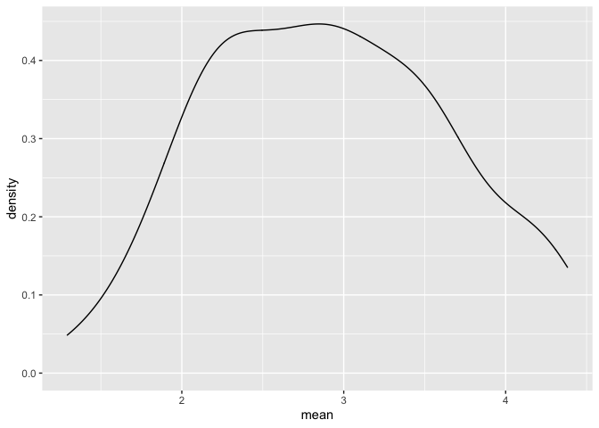
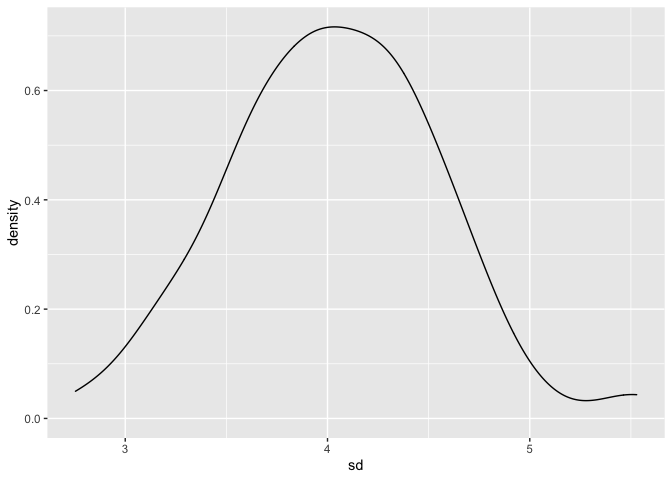
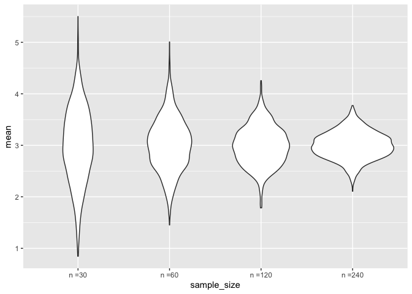

iteration
================
Anyu Zhu
11/4/2021

## Z scores

``` r
x_vec = rnorm(25, mean = 5, sd = 4)
(x_vec - mean(x_vec)) / sd(x_vec)
```

    ##  [1] -0.83687228  0.01576465 -1.05703126  1.50152998  0.16928872 -1.04107494
    ##  [7]  0.33550276  0.59957343  0.42849461 -0.49894708  1.41364561  0.23279252
    ## [13] -0.83138529 -2.50852027  1.00648110 -0.22481531 -0.19456260  0.81587675
    ## [19]  0.68682298  0.44756609  0.78971253  0.64568566 -0.09904161 -2.27133861
    ## [25]  0.47485186

``` r
z_scores = function(x){
  z = (x - mean(x)) / sd(x)
  return(z)
}

z_scores(x = x_vec)
```

    ##  [1] -0.83687228  0.01576465 -1.05703126  1.50152998  0.16928872 -1.04107494
    ##  [7]  0.33550276  0.59957343  0.42849461 -0.49894708  1.41364561  0.23279252
    ## [13] -0.83138529 -2.50852027  1.00648110 -0.22481531 -0.19456260  0.81587675
    ## [19]  0.68682298  0.44756609  0.78971253  0.64568566 -0.09904161 -2.27133861
    ## [25]  0.47485186

``` r
y_vec = rnorm(40, mean = 12, sd = 0.3)
z_scores(y_vec)
```

    ##  [1] -0.2022306 -0.3204049 -1.8795425 -0.7026191  0.3598721  1.4753003
    ##  [7] -0.2575539  0.3239812 -0.1994754 -1.7684514 -0.6277359 -0.6031866
    ## [13] -0.2060066  1.1686154  0.7692145 -0.3307538 -0.4360887  0.6907069
    ## [19]  0.5243537 -0.9523331 -0.9745524  0.2966039  0.7755665 -0.2688873
    ## [25]  0.9090459  0.3363531 -0.8613556  0.2687848 -1.4747590  1.5634498
    ## [31]  2.2124710 -0.5710916 -1.3737041  0.5398346 -0.2958126  2.7119068
    ## [37] -0.1822057  0.6821414 -0.1024770 -1.0169742

``` r
z_scores = function(x){
  if (!is.numeric(x)){
    stop("x needs to be numeric")
  }
  
  if (length(x) < 3){
    stop("x should have at least 3 numbers")
  }
  
  z = (x - mean(x)) / sd(x)
  return(z)
}

z_scores(c("a", "b", "c", "d"))
```

    ## Error in z_scores(c("a", "b", "c", "d")): x needs to be numeric

``` r
z_scores(3)
```

    ## Error in z_scores(3): x should have at least 3 numbers

``` r
z_scores(mtcars)
```

    ## Error in z_scores(mtcars): x needs to be numeric

## Multiple outputs

``` r
mean_and_sd = function(x){
  if (!is.numeric(x)){
    stop("x needs to be numeric")
  }
  
  if (length(x) < 3){
    stop("x should have at least 3 numbers")
  }
  
  mean_x = mean(x)
  sd_x = sd(x)
  
  output_df = 
    tibble(mean = mean_x,
           sd = sd_x)
  
  return(output_df)
}

mean_and_sd(x_vec)
```

    ## # A tibble: 1 × 2
    ##    mean    sd
    ##   <dbl> <dbl>
    ## 1  5.67  3.80

``` r
mean_and_sd(y_vec)
```

    ## # A tibble: 1 × 2
    ##    mean    sd
    ##   <dbl> <dbl>
    ## 1  12.0 0.253

## Different sample sizes, means, sds

``` r
sim_data = 
  tibble(
    x = rnorm(30, mean = 2, sd = 3)
  )

sim_data %>% 
  summarize(
    mean = mean(x),
    sd = sd(x)
  )
```

    ## # A tibble: 1 × 2
    ##    mean    sd
    ##   <dbl> <dbl>
    ## 1  2.51  2.82

function that simulates data, compute mean and sd.

``` r
sim_mean_sd = function(n, mu, sigma){
  sim_data = 
  tibble(
    x = rnorm(n, mean = mu, sd = sigma)
  )

  sim_data %>% 
    summarize(
      mean = mean(x),
      sd = sd(x)
    )
}

sim_mean_sd(30, 4, 3)
```

    ## # A tibble: 1 × 2
    ##    mean    sd
    ##   <dbl> <dbl>
    ## 1  3.96  2.43

## Napoleon dynamics

``` r
url = "https://www.amazon.com/product-reviews/B00005JNBQ/ref=cm_cr_arp_d_viewopt_rvwer?ie=UTF8&reviewerType=avp_only_reviews&sortBy=recent&pageNumber=1"

dynamite_html = read_html(url)

review_titles = 
  dynamite_html %>%
  html_elements(".a-text-bold span") %>%
  html_text()

review_stars = 
  dynamite_html %>%
  html_elements("#cm_cr-review_list .review-rating") %>%
  html_text()

review_text = 
  dynamite_html %>%
  html_elements(".review-text-content span") %>%
  html_text()

reviews = tibble(
  title = review_titles,
  stars = review_stars,
  text = review_text
)
```

Write a function gets reviews based on page url

``` r
get_page_reviews = function(page_url){
  
  page_html = read_html(page_url)

  review_titles = 
    page_html %>%
    html_elements(".a-text-bold span") %>%
    html_text()
  
  review_stars = 
    page_html %>%
    html_elements("#cm_cr-review_list .review-rating") %>%
    html_text()
  
  review_text = 
    page_html %>%
    html_elements(".review-text-content span") %>%
    html_text()
  
  reviews = tibble(
    title = review_titles,
    stars = review_stars,
    text = review_text
  )
  
  return(reviews)
}

base_url = "https://www.amazon.com/product-reviews/B00005JNBQ/ref=cm_cr_arp_d_viewopt_rvwer?ie=UTF8&reviewerType=avp_only_reviews&sortBy=recent&pageNumber="
urls = str_c(base_url, 1:5)

bind_rows(
  get_page_reviews(urls[1]),
  get_page_reviews(urls[2]),
  get_page_reviews(urls[3]),
  get_page_reviews(urls[4]),
  get_page_reviews(urls[5]))
```

    ## # A tibble: 50 × 3
    ##    title                                                 stars   text           
    ##    <chr>                                                 <chr>   <chr>          
    ##  1 it was                                                5.0 ou… "\n  mad good …
    ##  2 Fun!                                                  4.0 ou… "\n  Fun and e…
    ##  3 Vintage                                               5.0 ou… "\n  Easy to o…
    ##  4 too many commercials                                  1.0 ou… "\n  5 minutes…
    ##  5 this film is so good!                                 5.0 ou… "\n  VOTE FOR …
    ##  6 Good movie                                            5.0 ou… "\n  Weird sto…
    ##  7 I Just everyone to know this....                      5.0 ou… "\n  VOTE FOR …
    ##  8 the cobweb in his hair during the bike ramp scene lol 5.0 ou… "\n  5 stars f…
    ##  9 Best quirky movie ever                                5.0 ou… "\n  You all k…
    ## 10 Classic Film                                          5.0 ou… "\n  Had to or…
    ## # … with 40 more rows

## Lists

``` r
l = list(
  vec_numeric = 5:8,
  vec_logical = c(TRUE, FALSE),
  summary = summary(rnorm(1000, mean = 5, sd = 3))
)

l[[3]]
```

    ##    Min. 1st Qu.  Median    Mean 3rd Qu.    Max. 
    ##  -4.024   2.746   4.892   4.912   7.065  16.431

``` r
l[["summary"]]
```

    ##    Min. 1st Qu.  Median    Mean 3rd Qu.    Max. 
    ##  -4.024   2.746   4.892   4.912   7.065  16.431

## List of normals

``` r
list_norms = 
  list(
    a = rnorm(50, mean = 2, sd = 1),
    b = rnorm(50, mean = 5, sd = 3),
    c = rnorm(50, mean = 10, sd = 1.5),
    d = rnorm(50, mean = -8, sd = 4)
  )

mean_and_sd(list_norms[[1]])
```

    ## # A tibble: 1 × 2
    ##    mean    sd
    ##   <dbl> <dbl>
    ## 1  1.71  1.00

## for loop

to iterate over the list of normals

``` r
output = vector("list", length = 4)

for (i in 1:4){
  output[[1]] = mean_and_sd(list_norms[[1]])
}
```

use map:

``` r
output = map(list_norms, mean_and_sd)

output_2 = map(list_norms, summary)
```

## List Columns

``` r
listcol_df = 
  tibble(
    name = c("a", "b", "c", "d"),
    norms = list_norms
  )

listcol_df %>% pull(name)
```

    ## [1] "a" "b" "c" "d"

``` r
listcol_df %>% pull(norms)
```

    ## $a
    ##  [1]  0.7410786  1.7846155 -0.4719617  1.3258307  1.4987028  3.5423258
    ##  [7]  1.0379819  1.1278205  0.6023704  2.1798052  3.1540920  0.8014664
    ## [13]  1.5742756  3.3663086  1.3157026  2.6855122  2.3895035  0.6946041
    ## [19]  3.2168880  2.7951740  1.5117975  1.0960065  1.6095816  2.8140634
    ## [25]  1.4357507  0.1257947  1.8570953  2.7719040  0.8408821  1.7620845
    ## [31]  0.7778067  2.1168062  1.8675004  1.9663152  1.3776736  1.2906365
    ## [37]  2.8714454  2.1051380  1.8130647 -1.2131885  0.7243813  2.7629063
    ## [43]  1.5931849  0.7916822  1.5606773  1.6244193  1.4985576  2.4966126
    ## [49]  3.5208809  2.9880918
    ## 
    ## $b
    ##  [1]  8.7383676  4.0103980  7.5330341  2.0567727  4.5823358 11.5563137
    ##  [7]  4.9615160  4.0840732  3.2473596  7.3138055 11.3185681  6.2364711
    ## [13]  4.2162054 11.2213509  2.6635093  8.3945975  3.7359646  1.9347579
    ## [19]  8.6549161 -0.3992820  4.0752502  5.0465457  3.6730468  0.0859768
    ## [25]  3.0757965  0.3288928 10.7694910 -0.5704889 -1.3183553  7.0929456
    ## [31]  7.7223332  4.4120354  4.3795385  7.1751295  9.1961569  0.2283346
    ## [37]  8.9134912  5.5880352  3.9819697  8.7954324  7.8193211  8.8338575
    ## [43]  4.1265196  7.3285173  5.8871769  3.4484013 10.2716991  5.4851805
    ## [49]  4.8359469  6.5869148
    ## 
    ## $c
    ##  [1] 10.584602  8.941343  9.920232 13.909667  9.891110  9.555592 11.101496
    ##  [8] 10.602221  9.192548  8.375916 11.271702 10.178268 10.723371  9.563013
    ## [15]  7.521835 10.103642 13.585865  7.807342  8.522791  7.995919  9.452303
    ## [22] 12.072181  9.770024  9.616643  8.067059 10.097900 11.552990 13.390324
    ## [29] 11.972044  8.694965  9.245305 10.911183  9.984938 10.412995  8.031552
    ## [36]  9.360205  8.610394  8.607163  8.921649  9.377814  9.991498 10.950173
    ## [43]  9.236229  8.714487 12.424251 11.490800 11.045269 12.549956  8.533387
    ## [50] 13.073226
    ## 
    ## $d
    ##  [1]  -3.0942027  -6.7719080  -5.5026681  -7.7546342  -8.4433032 -14.3049342
    ##  [7]  -5.0296406   0.5692936   0.3590918  -7.3208227  -8.4315112  -7.2720220
    ## [13]  -3.4162873  -2.0908047  -6.3682234  -3.5428851  -8.1083034  -6.0091112
    ## [19]  -3.2574399   6.5582945  -8.2160104 -10.6725893  -6.2167682  -9.6233010
    ## [25]  -5.4588674  -6.6350064  -2.7353313 -11.8391059 -12.8223008  -1.7297078
    ## [31]  -7.0988568 -11.6896426 -12.2950896 -10.2094331  -5.6381544 -10.1091016
    ## [37]  -2.6326153  -7.0246215  -7.2164768  -8.0620789  -9.1903093  -8.6707166
    ## [43]  -3.3740857 -13.3550560  -3.6529249  -9.4027368  -5.0611070  -8.2336579
    ## [49] -13.3832516  -6.6123789

``` r
listcol_df %>% filter(name == "a")
```

    ## # A tibble: 1 × 2
    ##   name  norms       
    ##   <chr> <named list>
    ## 1 a     <dbl [50]>

``` r
listcol_df %>% 
  mutate(summaries = map(listcol_df$norms, mean_and_sd))
```

    ## # A tibble: 4 × 3
    ##   name  norms        summaries       
    ##   <chr> <named list> <named list>    
    ## 1 a     <dbl [50]>   <tibble [1 × 2]>
    ## 2 b     <dbl [50]>   <tibble [1 × 2]>
    ## 3 c     <dbl [50]>   <tibble [1 × 2]>
    ## 4 d     <dbl [50]>   <tibble [1 × 2]>

## Nested data

``` r
weather_df = 
  rnoaa::meteo_pull_monitors(
    c("USW00094728", "USC00519397", "USS0023B17S"),
    var = c("PRCP", "TMIN", "TMAX"), 
    date_min = "2017-01-01",
    date_max = "2017-12-31") %>%
  mutate(
    name = recode(
      id, 
      USW00094728 = "CentralPark_NY", 
      USC00519397 = "Waikiki_HA",
      USS0023B17S = "Waterhole_WA"),
    tmin = tmin / 10,
    tmax = tmax / 10) %>%
  select(name, id, everything())
```

    ## Registered S3 method overwritten by 'hoardr':
    ##   method           from
    ##   print.cache_info httr

    ## using cached file: ~/Library/Caches/R/noaa_ghcnd/USW00094728.dly

    ## date created (size, mb): 2021-10-05 10:29:26 (7.602)

    ## file min/max dates: 1869-01-01 / 2021-10-31

    ## using cached file: ~/Library/Caches/R/noaa_ghcnd/USC00519397.dly

    ## date created (size, mb): 2021-10-05 10:29:30 (1.697)

    ## file min/max dates: 1965-01-01 / 2020-02-29

    ## using cached file: ~/Library/Caches/R/noaa_ghcnd/USS0023B17S.dly

    ## date created (size, mb): 2021-10-05 10:29:32 (0.912)

    ## file min/max dates: 1999-09-01 / 2021-09-30

Nest data within location

``` r
weather_nested = nest(weather_df, data = date:tmin)

unnest(weather_nested, data)
```

    ## # A tibble: 1,095 × 6
    ##    name           id          date        prcp  tmax  tmin
    ##    <chr>          <chr>       <date>     <dbl> <dbl> <dbl>
    ##  1 CentralPark_NY USW00094728 2017-01-01     0   8.9   4.4
    ##  2 CentralPark_NY USW00094728 2017-01-02    53   5     2.8
    ##  3 CentralPark_NY USW00094728 2017-01-03   147   6.1   3.9
    ##  4 CentralPark_NY USW00094728 2017-01-04     0  11.1   1.1
    ##  5 CentralPark_NY USW00094728 2017-01-05     0   1.1  -2.7
    ##  6 CentralPark_NY USW00094728 2017-01-06    13   0.6  -3.8
    ##  7 CentralPark_NY USW00094728 2017-01-07    81  -3.2  -6.6
    ##  8 CentralPark_NY USW00094728 2017-01-08     0  -3.8  -8.8
    ##  9 CentralPark_NY USW00094728 2017-01-09     0  -4.9  -9.9
    ## 10 CentralPark_NY USW00094728 2017-01-10     0   7.8  -6  
    ## # … with 1,085 more rows

``` r
weather_nested %>% pull(data)
```

    ## [[1]]
    ## # A tibble: 365 × 4
    ##    date        prcp  tmax  tmin
    ##    <date>     <dbl> <dbl> <dbl>
    ##  1 2017-01-01     0   8.9   4.4
    ##  2 2017-01-02    53   5     2.8
    ##  3 2017-01-03   147   6.1   3.9
    ##  4 2017-01-04     0  11.1   1.1
    ##  5 2017-01-05     0   1.1  -2.7
    ##  6 2017-01-06    13   0.6  -3.8
    ##  7 2017-01-07    81  -3.2  -6.6
    ##  8 2017-01-08     0  -3.8  -8.8
    ##  9 2017-01-09     0  -4.9  -9.9
    ## 10 2017-01-10     0   7.8  -6  
    ## # … with 355 more rows
    ## 
    ## [[2]]
    ## # A tibble: 365 × 4
    ##    date        prcp  tmax  tmin
    ##    <date>     <dbl> <dbl> <dbl>
    ##  1 2017-01-01     0  26.7  16.7
    ##  2 2017-01-02     0  27.2  16.7
    ##  3 2017-01-03     0  27.8  17.2
    ##  4 2017-01-04     0  27.2  16.7
    ##  5 2017-01-05     0  27.8  16.7
    ##  6 2017-01-06     0  27.2  16.7
    ##  7 2017-01-07     0  27.2  16.7
    ##  8 2017-01-08     0  25.6  15  
    ##  9 2017-01-09     0  27.2  15.6
    ## 10 2017-01-10     0  28.3  17.2
    ## # … with 355 more rows
    ## 
    ## [[3]]
    ## # A tibble: 365 × 4
    ##    date        prcp  tmax  tmin
    ##    <date>     <dbl> <dbl> <dbl>
    ##  1 2017-01-01   432  -6.8 -10.7
    ##  2 2017-01-02    25 -10.5 -12.4
    ##  3 2017-01-03     0  -8.9 -15.9
    ##  4 2017-01-04     0  -9.9 -15.5
    ##  5 2017-01-05     0  -5.9 -14.2
    ##  6 2017-01-06     0  -4.4 -11.3
    ##  7 2017-01-07    51   0.6 -11.5
    ##  8 2017-01-08    76   2.3  -1.2
    ##  9 2017-01-09    51  -1.2  -7  
    ## 10 2017-01-10     0  -5   -14.2
    ## # … with 355 more rows

``` r
lm(tmax ~ tmin, data = weather_nested$data[[3]])
```

    ## 
    ## Call:
    ## lm(formula = tmax ~ tmin, data = weather_nested$data[[3]])
    ## 
    ## Coefficients:
    ## (Intercept)         tmin  
    ##       7.499        1.221

``` r
weather_lm = function(df){
  lm(tmax ~ tmin, data = df)
}

weather_lm(weather_nested$data[[1]])
```

    ## 
    ## Call:
    ## lm(formula = tmax ~ tmin, data = df)
    ## 
    ## Coefficients:
    ## (Intercept)         tmin  
    ##       7.209        1.039

``` r
map(weather_nested$data, weather_lm)
```

    ## [[1]]
    ## 
    ## Call:
    ## lm(formula = tmax ~ tmin, data = df)
    ## 
    ## Coefficients:
    ## (Intercept)         tmin  
    ##       7.209        1.039  
    ## 
    ## 
    ## [[2]]
    ## 
    ## Call:
    ## lm(formula = tmax ~ tmin, data = df)
    ## 
    ## Coefficients:
    ## (Intercept)         tmin  
    ##     20.0966       0.4509  
    ## 
    ## 
    ## [[3]]
    ## 
    ## Call:
    ## lm(formula = tmax ~ tmin, data = df)
    ## 
    ## Coefficients:
    ## (Intercept)         tmin  
    ##       7.499        1.221

``` r
weather_nested %>% 
  mutate(lm_results = map(data, weather_lm))
```

    ## # A tibble: 3 × 4
    ##   name           id          data               lm_results
    ##   <chr>          <chr>       <list>             <list>    
    ## 1 CentralPark_NY USW00094728 <tibble [365 × 4]> <lm>      
    ## 2 Waikiki_HA     USC00519397 <tibble [365 × 4]> <lm>      
    ## 3 Waterhole_WA   USS0023B17S <tibble [365 × 4]> <lm>

## Napoleon

``` r
map(urls, get_page_reviews)
```

    ## [[1]]
    ## # A tibble: 10 × 3
    ##    title                                                 stars   text           
    ##    <chr>                                                 <chr>   <chr>          
    ##  1 it was                                                5.0 ou… "\n  mad good …
    ##  2 Fun!                                                  4.0 ou… "\n  Fun and e…
    ##  3 Vintage                                               5.0 ou… "\n  Easy to o…
    ##  4 too many commercials                                  1.0 ou… "\n  5 minutes…
    ##  5 this film is so good!                                 5.0 ou… "\n  VOTE FOR …
    ##  6 Good movie                                            5.0 ou… "\n  Weird sto…
    ##  7 I Just everyone to know this....                      5.0 ou… "\n  VOTE FOR …
    ##  8 the cobweb in his hair during the bike ramp scene lol 5.0 ou… "\n  5 stars f…
    ##  9 Best quirky movie ever                                5.0 ou… "\n  You all k…
    ## 10 Classic Film                                          5.0 ou… "\n  Had to or…
    ## 
    ## [[2]]
    ## # A tibble: 10 × 3
    ##    title                             stars              text                    
    ##    <chr>                             <chr>              <chr>                   
    ##  1 hehehehe                          5.0 out of 5 stars "\n  goodjobboys\n"     
    ##  2 Painful                           1.0 out of 5 stars "\n  I think I sneezed …
    ##  3 GRAND                             5.0 out of 5 stars "\n  GRAND\n"           
    ##  4 Hello, 90s                        5.0 out of 5 stars "\n  So nostalgic movie…
    ##  5 Cult Classic                      5.0 out of 5 stars "\n  Watched it with my…
    ##  6 Format was inaccurate             4.0 out of 5 stars "\n  There was an optio…
    ##  7 Good funny                        3.0 out of 5 stars "\n  Would recommend\n" 
    ##  8 Not available w/in 48 hour window 1.0 out of 5 stars "\n  I couldn't watch i…
    ##  9 Your mom went to college.         5.0 out of 5 stars "\n  Classic funny movi…
    ## 10 Very funny movie                  5.0 out of 5 stars "\n  I watch this movie…
    ## 
    ## [[3]]
    ## # A tibble: 10 × 3
    ##    title                                       stars              text          
    ##    <chr>                                       <chr>              <chr>         
    ##  1 Watch it twice! Trust me!                   5.0 out of 5 stars "\n  Nothing …
    ##  2 A classic                                   5.0 out of 5 stars "\n  If you d…
    ##  3 Can't say how many times I've seen          5.0 out of 5 stars "\n  Such a g…
    ##  4 I pity the fool who doesn’t own this movie. 5.0 out of 5 stars "\n  I love t…
    ##  5 I don’t know why it’s so popular!           2.0 out of 5 stars "\n  My girlf…
    ##  6 Okay                                        3.0 out of 5 stars "\n  Okay\n"  
    ##  7 A WHOLESOME comedic journey                 5.0 out of 5 stars "\n  Not a mo…
    ##  8 Hilarious                                   5.0 out of 5 stars "\n  Funny\n" 
    ##  9 Love it                                     5.0 out of 5 stars "\n  What of …
    ## 10 WORTH IT!                                   5.0 out of 5 stars "\n  It's the…
    ## 
    ## [[4]]
    ## # A tibble: 10 × 3
    ##    title                                         stars              text        
    ##    <chr>                                         <chr>              <chr>       
    ##  1 Funny movie.                                  5.0 out of 5 stars "\n  Great …
    ##  2 Best movie ever!                              5.0 out of 5 stars "\n  Got th…
    ##  3 I was stuck in the oil patch back in the day. 5.0 out of 5 stars "\n  I watc…
    ##  4 Funny Dork humor                              5.0 out of 5 stars "\n  Humor …
    ##  5 Still funny!                                  5.0 out of 5 stars "\n  Still …
    ##  6 Love it!! 💜                                  5.0 out of 5 stars "\n  Love i…
    ##  7 LOVE it                                       5.0 out of 5 stars "\n  cult c…
    ##  8 Perfect                                       5.0 out of 5 stars "\n  Exactl…
    ##  9 Love this movie!                              5.0 out of 5 stars "\n  Great …
    ## 10 Love it                                       5.0 out of 5 stars "\n  Love t…
    ## 
    ## [[5]]
    ## # A tibble: 10 × 3
    ##    title                             stars              text                    
    ##    <chr>                             <chr>              <chr>                   
    ##  1 As described                      3.0 out of 5 stars "\n  Book is as describ…
    ##  2 GOSH!!!                           5.0 out of 5 stars "\n  Just watch the mov…
    ##  3 Watch it right now                5.0 out of 5 stars "\n  You need to watch …
    ##  4 At this point it’s an addiction   5.0 out of 5 stars "\n  I watch this movie…
    ##  5 💕                                5.0 out of 5 stars "\n  Hands down, one of…
    ##  6 Good dumb movie                   5.0 out of 5 stars "\n  I really wanted to…
    ##  7 funny                             5.0 out of 5 stars "\n  so funny and inven…
    ##  8 Best Movie- Try to prove me wrong 5.0 out of 5 stars "\n  Best movie ever\n" 
    ##  9 Vote For Pedro!!                  5.0 out of 5 stars "\n  What is NOT to lik…
    ## 10 So Funny                          5.0 out of 5 stars "\n  This is such a goo…

``` r
napoleon_df = tibble(
  urls = urls
)

napoleon_df %>% 
  mutate(reviews = map(urls, get_page_reviews)) %>% 
  select(reviews) %>% 
  unnest()
```

    ## Warning: `cols` is now required when using unnest().
    ## Please use `cols = c(reviews)`

    ## # A tibble: 50 × 3
    ##    title                                                 stars   text           
    ##    <chr>                                                 <chr>   <chr>          
    ##  1 it was                                                5.0 ou… "\n  mad good …
    ##  2 Fun!                                                  4.0 ou… "\n  Fun and e…
    ##  3 Vintage                                               5.0 ou… "\n  Easy to o…
    ##  4 too many commercials                                  1.0 ou… "\n  5 minutes…
    ##  5 this film is so good!                                 5.0 ou… "\n  VOTE FOR …
    ##  6 Good movie                                            5.0 ou… "\n  Weird sto…
    ##  7 I Just everyone to know this....                      5.0 ou… "\n  VOTE FOR …
    ##  8 the cobweb in his hair during the bike ramp scene lol 5.0 ou… "\n  5 stars f…
    ##  9 Best quirky movie ever                                5.0 ou… "\n  You all k…
    ## 10 Classic Film                                          5.0 ou… "\n  Had to or…
    ## # … with 40 more rows

## Simulation

start with a for loop

``` r
output = vector("list", length = 100)

for (i in 1:100){
  output[[i]] = sim_mean_sd(30, 3, 4)
}

bind_rows(output)
```

    ## # A tibble: 100 × 2
    ##     mean    sd
    ##    <dbl> <dbl>
    ##  1  1.73  3.61
    ##  2  1.98  3.42
    ##  3  2.50  3.31
    ##  4  4.86  4.66
    ##  5  2.36  4.25
    ##  6  3.32  3.27
    ##  7  3.26  4.67
    ##  8  3.29  3.33
    ##  9  2.58  4.40
    ## 10  2.69  3.96
    ## # … with 90 more rows

use a loop function

``` r
sim_results = 
  rerun(100, sim_mean_sd(30, 3, 4)) %>% 
  bind_rows()
```

look at results

``` r
sim_results %>% 
  ggplot(aes(x = mean)) + geom_density()
```

<!-- -->

``` r
sim_results %>% 
  summarize(
    avg_sample_mean = mean(mean),
    ad_samp_mean = sd(mean)
  )
```

    ## # A tibble: 1 × 2
    ##   avg_sample_mean ad_samp_mean
    ##             <dbl>        <dbl>
    ## 1            2.91        0.671

``` r
sim_results %>% 
  ggplot(aes(x = sd)) + geom_density()
```

<!-- -->

## try other sample sizes

``` r
n_list = list(
  "n = 30" = 30,
  "n = 60" = 60,
  "n = 120" = 120,
  "n = 240" = 240
)

output = vector("list", length = 4)

output[[1]] = rerun(100, sim_mean_sd(n = n_list[[1]], 3, 4)) %>% bind_rows()

for(i in 1:4){
  output[[i]] = rerun(100, sim_mean_sd(n = n_list[[i]], 3, 4)) %>% 
    bind_rows()
}
```

``` r
sim_results = tibble(
  sample_size = c(30, 60, 120, 240)
) %>% 
  mutate(
    output_lists = map(.x = sample_size, ~rerun(1000, sim_mean_sd(.x, 3, 4))),
    estimate_df = map(output_lists, bind_rows)
  ) %>% 
  select(-output_lists) %>% 
  unnest(estimate_df)
```

some df things

``` r
sim_results %>% 
  mutate(
    sample_size = str_c("n =", sample_size),
    sample_size = fct_inorder(sample_size)
  ) %>% 
  ggplot(aes(x = sample_size, y = mean)) +
  geom_violin()
```

<!-- -->

``` r
sim_results %>% 
  group_by(sample_size) %>% 
  summarize(
    avg_samp_mean = mean(mean),
    sd_sample_mean = sd(mean)
  )
```

    ## # A tibble: 4 × 3
    ##   sample_size avg_samp_mean sd_sample_mean
    ##         <dbl>         <dbl>          <dbl>
    ## 1          30          3.00          0.724
    ## 2          60          3.02          0.512
    ## 3         120          2.99          0.378
    ## 4         240          3.00          0.263
