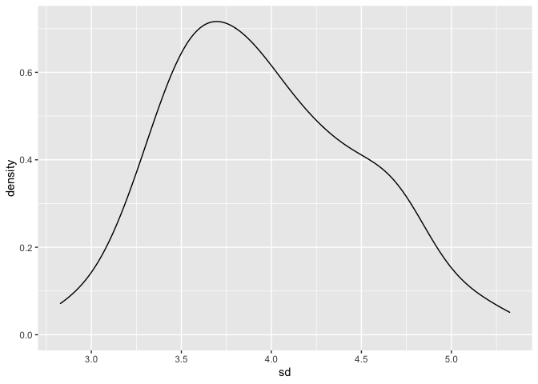

iteration
================
Anyu Zhu
11/4/2021

## Z scores

``` r
x_vec = rnorm(25, mean = 5, sd = 4)
(x_vec - mean(x_vec)) / sd(x_vec)
```

    ##  [1] -0.43711687 -0.14018392  1.70817417  1.08111861 -0.85543794 -2.03145792
    ##  [7] -0.10826190 -0.33507591  1.14142730 -0.83336183 -0.90912969 -0.45192956
    ## [13] -0.42626540 -0.06574881  0.39052190 -0.44820644 -0.81261562  0.23121242
    ## [19] -0.04561811  0.47984147 -0.43971477  3.13999599  0.07801675  0.31258891
    ## [25] -0.22277282

``` r
z_scores = function(x){
  z = (x - mean(x)) / sd(x)
  return(z)
}

z_scores(x = x_vec)
```

    ##  [1] -0.43711687 -0.14018392  1.70817417  1.08111861 -0.85543794 -2.03145792
    ##  [7] -0.10826190 -0.33507591  1.14142730 -0.83336183 -0.90912969 -0.45192956
    ## [13] -0.42626540 -0.06574881  0.39052190 -0.44820644 -0.81261562  0.23121242
    ## [19] -0.04561811  0.47984147 -0.43971477  3.13999599  0.07801675  0.31258891
    ## [25] -0.22277282

``` r
y_vec = rnorm(40, mean = 12, sd = 0.3)
z_scores(y_vec)
```

    ##  [1]  0.35903309  0.98960614  2.24259130 -0.02563529  1.16494425  0.64489659
    ##  [7] -0.81740437 -1.75539728 -0.04337247 -1.22376616  0.48605341  0.53102819
    ## [13]  0.16518599 -0.24294157 -1.18129220 -0.65068383  0.67168690 -0.92735719
    ## [19]  1.64619888  0.18732896  0.97675976 -1.55352996 -0.24180350  2.40391546
    ## [25] -0.15068323 -0.43809521  0.94300981  1.35016536 -1.90006410 -0.08270438
    ## [31] -0.34417728 -0.07313673 -0.77930603  0.52500601  0.03002733 -0.73349687
    ## [37] -1.15657000 -0.67469356  0.17202799 -0.49335419

``` r
z_scores = function(x){
  if (!is.numeric(x)){
    stop("x needs to be numeric")
  }
  
  if (length(x) < 3){
    stop("x should have at least 3 numbers")
  }
  
  z = (x - mean(x)) / sd(x)
  return(z)
}

z_scores(c("a", "b", "c", "d"))
```

    ## Error in z_scores(c("a", "b", "c", "d")): x needs to be numeric

``` r
z_scores(3)
```

    ## Error in z_scores(3): x should have at least 3 numbers

``` r
z_scores(mtcars)
```

    ## Error in z_scores(mtcars): x needs to be numeric

## Multiple outputs

``` r
mean_and_sd = function(x){
  if (!is.numeric(x)){
    stop("x needs to be numeric")
  }
  
  if (length(x) < 3){
    stop("x should have at least 3 numbers")
  }
  
  mean_x = mean(x)
  sd_x = sd(x)
  
  output_df = 
    tibble(mean = mean_x,
           sd = sd_x)
  
  return(output_df)
}

mean_and_sd(x_vec)
```

    ## # A tibble: 1 × 2
    ##    mean    sd
    ##   <dbl> <dbl>
    ## 1  4.51  4.09

``` r
mean_and_sd(y_vec)
```

    ## # A tibble: 1 × 2
    ##    mean    sd
    ##   <dbl> <dbl>
    ## 1  12.0 0.277

## Different sample sizes, means, sds

``` r
sim_data = 
  tibble(
    x = rnorm(30, mean = 2, sd = 3)
  )

sim_data %>% 
  summarize(
    mean = mean(x),
    sd = sd(x)
  )
```

    ## # A tibble: 1 × 2
    ##    mean    sd
    ##   <dbl> <dbl>
    ## 1  1.80  2.82

function that simulates data, compute mean and sd.

``` r
sim_mean_sd = function(n, mu, sigma){
  sim_data = 
  tibble(
    x = rnorm(n, mean = mu, sd = sigma)
  )

  sim_data %>% 
    summarize(
      mean = mean(x),
      sd = sd(x)
    )
}

sim_mean_sd(30, 4, 3)
```

    ## # A tibble: 1 × 2
    ##    mean    sd
    ##   <dbl> <dbl>
    ## 1  3.92  3.44

## Napoleon dynamics

``` r
url = "https://www.amazon.com/product-reviews/B00005JNBQ/ref=cm_cr_arp_d_viewopt_rvwer?ie=UTF8&reviewerType=avp_only_reviews&sortBy=recent&pageNumber=1"

dynamite_html = read_html(url)

review_titles = 
  dynamite_html %>%
  html_elements(".a-text-bold span") %>%
  html_text()

review_stars = 
  dynamite_html %>%
  html_elements("#cm_cr-review_list .review-rating") %>%
  html_text()

review_text = 
  dynamite_html %>%
  html_elements(".review-text-content span") %>%
  html_text()

reviews = tibble(
  title = review_titles,
  stars = review_stars,
  text = review_text
)
```

Write a function gets reviews based on page url

``` r
get_page_reviews = function(page_url){
  
  page_html = read_html(page_url)

  review_titles = 
    page_html %>%
    html_elements(".a-text-bold span") %>%
    html_text()
  
  review_stars = 
    page_html %>%
    html_elements("#cm_cr-review_list .review-rating") %>%
    html_text()
  
  review_text = 
    page_html %>%
    html_elements(".review-text-content span") %>%
    html_text()
  
  reviews = tibble(
    title = review_titles,
    stars = review_stars,
    text = review_text
  )
  
  return(reviews)
}

base_url = "https://www.amazon.com/product-reviews/B00005JNBQ/ref=cm_cr_arp_d_viewopt_rvwer?ie=UTF8&reviewerType=avp_only_reviews&sortBy=recent&pageNumber="
urls = str_c(base_url, 1:5)

bind_rows(
  get_page_reviews(urls[1]),
  get_page_reviews(urls[2]),
  get_page_reviews(urls[3]),
  get_page_reviews(urls[4]),
  get_page_reviews(urls[5]))
```

    ## # A tibble: 50 × 3
    ##    title                                                 stars   text           
    ##    <chr>                                                 <chr>   <chr>          
    ##  1 it was                                                5.0 ou… "\n  mad good …
    ##  2 Fun!                                                  4.0 ou… "\n  Fun and e…
    ##  3 Vintage                                               5.0 ou… "\n  Easy to o…
    ##  4 too many commercials                                  1.0 ou… "\n  5 minutes…
    ##  5 this film is so good!                                 5.0 ou… "\n  VOTE FOR …
    ##  6 Good movie                                            5.0 ou… "\n  Weird sto…
    ##  7 I Just everyone to know this....                      5.0 ou… "\n  VOTE FOR …
    ##  8 the cobweb in his hair during the bike ramp scene lol 5.0 ou… "\n  5 stars f…
    ##  9 Best quirky movie ever                                5.0 ou… "\n  You all k…
    ## 10 Classic Film                                          5.0 ou… "\n  Had to or…
    ## # … with 40 more rows

## Lists

``` r
l = list(
  vec_numeric = 5:8,
  vec_logical = c(TRUE, FALSE),
  summary = summary(rnorm(1000, mean = 5, sd = 3))
)

l[[3]]
```

    ##    Min. 1st Qu.  Median    Mean 3rd Qu.    Max. 
    ##  -3.796   2.818   4.972   4.889   6.894  13.554

``` r
l[["summary"]]
```

    ##    Min. 1st Qu.  Median    Mean 3rd Qu.    Max. 
    ##  -3.796   2.818   4.972   4.889   6.894  13.554

## List of normals

``` r
list_norms = 
  list(
    a = rnorm(50, mean = 2, sd = 1),
    b = rnorm(50, mean = 5, sd = 3),
    c = rnorm(50, mean = 10, sd = 1.5),
    d = rnorm(50, mean = -8, sd = 4)
  )

mean_and_sd(list_norms[[1]])
```

    ## # A tibble: 1 × 2
    ##    mean    sd
    ##   <dbl> <dbl>
    ## 1  2.23 0.900

## for loop

to iterate over the list of normals

``` r
output = vector("list", length = 4)

for (i in 1:4){
  output[[1]] = mean_and_sd(list_norms[[1]])
}
```

use map:

``` r
output = map(list_norms, mean_and_sd)

output_2 = map(list_norms, summary)
```

## List Columns

``` r
listcol_df = 
  tibble(
    name = c("a", "b", "c", "d"),
    norms = list_norms
  )

listcol_df %>% pull(name)
```

    ## [1] "a" "b" "c" "d"

``` r
listcol_df %>% pull(norms)
```

    ## $a
    ##  [1] 2.6903686 1.8253004 3.8271614 3.9130585 1.6992286 2.6959533 1.7762231
    ##  [8] 2.6260563 0.7852765 3.0545501 0.9199900 2.1489123 1.6494497 2.6229096
    ## [15] 2.3260358 4.2650253 2.5246871 3.2135467 2.7642194 2.5262783 2.0420693
    ## [22] 2.6759306 1.9525130 2.7255379 1.3621091 1.6878070 2.7065168 1.0310138
    ## [29] 0.0703726 2.5024660 3.1538021 2.5860972 1.1614528 0.9235214 1.0752719
    ## [36] 3.7547171 2.4260437 2.3773982 2.7135119 0.2397341 2.5691171 1.8562197
    ## [43] 2.0951570 1.4787562 2.1722275 3.1790355 2.5122115 2.7377488 2.4964681
    ## [50] 1.4206862
    ## 
    ## $b
    ##  [1]  9.6594668  6.4046556  4.7300039  5.5892436  6.6958655  8.5531960
    ##  [7]  8.4249796  4.3823460 -1.2457299  6.7868122  4.2415377  3.7271447
    ## [13]  0.7949788  4.6949061  3.5135336 -2.5040186  1.4359849 12.3706074
    ## [19]  6.0332532  5.2380276  3.7485568  8.9307606  3.4700870  2.3586212
    ## [25]  8.2269017  8.0010642  4.1566152  3.4861122  8.1704887  1.1670985
    ## [31]  7.7014087  9.9658587  2.8622266  2.2627031  4.1353049  7.1668366
    ## [37]  8.1889401  4.9537960  2.5133060  2.6531727 10.4746371  3.7691169
    ## [43]  9.7532999  4.6105855  1.2029883  2.5852074  4.4814050  2.5515313
    ## [49] -3.0417780  6.3206888
    ## 
    ## $c
    ##  [1]  9.478453 11.561954  9.547016  9.857999 10.741062 10.220948 10.862210
    ##  [8]  7.698177  9.849106  9.476663 11.328898 10.931334 11.420621 10.278794
    ## [15] 10.435565  9.208590 10.539227  9.323899  8.177762  8.700510  9.168897
    ## [22] 10.008930 12.099150  8.907996  8.923615 11.165103  8.539796  8.718438
    ## [29] 11.364123 10.681480 12.780718  9.857491  9.567151  6.653682  7.780054
    ## [36] 10.040382 10.126318 12.598828  8.997552 13.103531  8.804086  9.852558
    ## [43] 12.179140  7.498842  9.908912 11.151204  8.762803  7.865865  9.208216
    ## [50]  9.811679
    ## 
    ## $d
    ##  [1]  -4.708969  -9.261615  -9.896189  -3.537905  -8.453213  -8.345434
    ##  [7]  -9.634360  -1.217333  -6.232883  -2.795823  -7.644747  -1.807396
    ## [13]  -4.353945  -2.311417  -6.464605  -4.472553 -10.863738  -9.976872
    ## [19] -10.296643  -7.078749  -4.853668 -11.388467  -4.110038  -4.611866
    ## [25]  -3.768028  -4.590293 -15.266061 -10.056638   1.635761  -6.727535
    ## [31]  -3.441512 -14.609772 -16.661974  -6.306116 -12.110433  -9.443734
    ## [37]  -6.934991  -9.040049  -3.934465  -3.790642  -3.174336  -5.367005
    ## [43]  -6.796617 -11.806060 -10.892601  -4.379100 -13.010142 -15.723184
    ## [49] -10.703635  -1.209279

``` r
listcol_df %>% filter(name == "a")
```

    ## # A tibble: 1 × 2
    ##   name  norms       
    ##   <chr> <named list>
    ## 1 a     <dbl [50]>

``` r
listcol_df %>% 
  mutate(summaries = map(listcol_df$norms, mean_and_sd))
```

    ## # A tibble: 4 × 3
    ##   name  norms        summaries       
    ##   <chr> <named list> <named list>    
    ## 1 a     <dbl [50]>   <tibble [1 × 2]>
    ## 2 b     <dbl [50]>   <tibble [1 × 2]>
    ## 3 c     <dbl [50]>   <tibble [1 × 2]>
    ## 4 d     <dbl [50]>   <tibble [1 × 2]>

## Nested data

``` r
weather_df = 
  rnoaa::meteo_pull_monitors(
    c("USW00094728", "USC00519397", "USS0023B17S"),
    var = c("PRCP", "TMIN", "TMAX"), 
    date_min = "2017-01-01",
    date_max = "2017-12-31") %>%
  mutate(
    name = recode(
      id, 
      USW00094728 = "CentralPark_NY", 
      USC00519397 = "Waikiki_HA",
      USS0023B17S = "Waterhole_WA"),
    tmin = tmin / 10,
    tmax = tmax / 10) %>%
  select(name, id, everything())
```

    ## Registered S3 method overwritten by 'hoardr':
    ##   method           from
    ##   print.cache_info httr

    ## using cached file: ~/Library/Caches/R/noaa_ghcnd/USW00094728.dly

    ## date created (size, mb): 2021-10-05 10:29:26 (7.602)

    ## file min/max dates: 1869-01-01 / 2021-10-31

    ## using cached file: ~/Library/Caches/R/noaa_ghcnd/USC00519397.dly

    ## date created (size, mb): 2021-10-05 10:29:30 (1.697)

    ## file min/max dates: 1965-01-01 / 2020-02-29

    ## using cached file: ~/Library/Caches/R/noaa_ghcnd/USS0023B17S.dly

    ## date created (size, mb): 2021-10-05 10:29:32 (0.912)

    ## file min/max dates: 1999-09-01 / 2021-09-30

Nest data within location

``` r
weather_nested = nest(weather_df, data = date:tmin)

unnest(weather_nested, data)
```

    ## # A tibble: 1,095 × 6
    ##    name           id          date        prcp  tmax  tmin
    ##    <chr>          <chr>       <date>     <dbl> <dbl> <dbl>
    ##  1 CentralPark_NY USW00094728 2017-01-01     0   8.9   4.4
    ##  2 CentralPark_NY USW00094728 2017-01-02    53   5     2.8
    ##  3 CentralPark_NY USW00094728 2017-01-03   147   6.1   3.9
    ##  4 CentralPark_NY USW00094728 2017-01-04     0  11.1   1.1
    ##  5 CentralPark_NY USW00094728 2017-01-05     0   1.1  -2.7
    ##  6 CentralPark_NY USW00094728 2017-01-06    13   0.6  -3.8
    ##  7 CentralPark_NY USW00094728 2017-01-07    81  -3.2  -6.6
    ##  8 CentralPark_NY USW00094728 2017-01-08     0  -3.8  -8.8
    ##  9 CentralPark_NY USW00094728 2017-01-09     0  -4.9  -9.9
    ## 10 CentralPark_NY USW00094728 2017-01-10     0   7.8  -6  
    ## # … with 1,085 more rows

``` r
weather_nested %>% pull(data)
```

    ## [[1]]
    ## # A tibble: 365 × 4
    ##    date        prcp  tmax  tmin
    ##    <date>     <dbl> <dbl> <dbl>
    ##  1 2017-01-01     0   8.9   4.4
    ##  2 2017-01-02    53   5     2.8
    ##  3 2017-01-03   147   6.1   3.9
    ##  4 2017-01-04     0  11.1   1.1
    ##  5 2017-01-05     0   1.1  -2.7
    ##  6 2017-01-06    13   0.6  -3.8
    ##  7 2017-01-07    81  -3.2  -6.6
    ##  8 2017-01-08     0  -3.8  -8.8
    ##  9 2017-01-09     0  -4.9  -9.9
    ## 10 2017-01-10     0   7.8  -6  
    ## # … with 355 more rows
    ## 
    ## [[2]]
    ## # A tibble: 365 × 4
    ##    date        prcp  tmax  tmin
    ##    <date>     <dbl> <dbl> <dbl>
    ##  1 2017-01-01     0  26.7  16.7
    ##  2 2017-01-02     0  27.2  16.7
    ##  3 2017-01-03     0  27.8  17.2
    ##  4 2017-01-04     0  27.2  16.7
    ##  5 2017-01-05     0  27.8  16.7
    ##  6 2017-01-06     0  27.2  16.7
    ##  7 2017-01-07     0  27.2  16.7
    ##  8 2017-01-08     0  25.6  15  
    ##  9 2017-01-09     0  27.2  15.6
    ## 10 2017-01-10     0  28.3  17.2
    ## # … with 355 more rows
    ## 
    ## [[3]]
    ## # A tibble: 365 × 4
    ##    date        prcp  tmax  tmin
    ##    <date>     <dbl> <dbl> <dbl>
    ##  1 2017-01-01   432  -6.8 -10.7
    ##  2 2017-01-02    25 -10.5 -12.4
    ##  3 2017-01-03     0  -8.9 -15.9
    ##  4 2017-01-04     0  -9.9 -15.5
    ##  5 2017-01-05     0  -5.9 -14.2
    ##  6 2017-01-06     0  -4.4 -11.3
    ##  7 2017-01-07    51   0.6 -11.5
    ##  8 2017-01-08    76   2.3  -1.2
    ##  9 2017-01-09    51  -1.2  -7  
    ## 10 2017-01-10     0  -5   -14.2
    ## # … with 355 more rows

``` r
lm(tmax ~ tmin, data = weather_nested$data[[3]])
```

    ## 
    ## Call:
    ## lm(formula = tmax ~ tmin, data = weather_nested$data[[3]])
    ## 
    ## Coefficients:
    ## (Intercept)         tmin  
    ##       7.499        1.221

``` r
weather_lm = function(df){
  lm(tmax ~ tmin, data = df)
}

weather_lm(weather_nested$data[[1]])
```

    ## 
    ## Call:
    ## lm(formula = tmax ~ tmin, data = df)
    ## 
    ## Coefficients:
    ## (Intercept)         tmin  
    ##       7.209        1.039

``` r
map(weather_nested$data, weather_lm)
```

    ## [[1]]
    ## 
    ## Call:
    ## lm(formula = tmax ~ tmin, data = df)
    ## 
    ## Coefficients:
    ## (Intercept)         tmin  
    ##       7.209        1.039  
    ## 
    ## 
    ## [[2]]
    ## 
    ## Call:
    ## lm(formula = tmax ~ tmin, data = df)
    ## 
    ## Coefficients:
    ## (Intercept)         tmin  
    ##     20.0966       0.4509  
    ## 
    ## 
    ## [[3]]
    ## 
    ## Call:
    ## lm(formula = tmax ~ tmin, data = df)
    ## 
    ## Coefficients:
    ## (Intercept)         tmin  
    ##       7.499        1.221

``` r
weather_nested %>% 
  mutate(lm_results = map(data, weather_lm))
```

    ## # A tibble: 3 × 4
    ##   name           id          data               lm_results
    ##   <chr>          <chr>       <list>             <list>    
    ## 1 CentralPark_NY USW00094728 <tibble [365 × 4]> <lm>      
    ## 2 Waikiki_HA     USC00519397 <tibble [365 × 4]> <lm>      
    ## 3 Waterhole_WA   USS0023B17S <tibble [365 × 4]> <lm>

## Napoleon

``` r
map(urls, get_page_reviews)
```

    ## [[1]]
    ## # A tibble: 10 × 3
    ##    title                                                 stars   text           
    ##    <chr>                                                 <chr>   <chr>          
    ##  1 it was                                                5.0 ou… "\n  mad good …
    ##  2 Fun!                                                  4.0 ou… "\n  Fun and e…
    ##  3 Vintage                                               5.0 ou… "\n  Easy to o…
    ##  4 too many commercials                                  1.0 ou… "\n  5 minutes…
    ##  5 this film is so good!                                 5.0 ou… "\n  VOTE FOR …
    ##  6 Good movie                                            5.0 ou… "\n  Weird sto…
    ##  7 I Just everyone to know this....                      5.0 ou… "\n  VOTE FOR …
    ##  8 the cobweb in his hair during the bike ramp scene lol 5.0 ou… "\n  5 stars f…
    ##  9 Best quirky movie ever                                5.0 ou… "\n  You all k…
    ## 10 Classic Film                                          5.0 ou… "\n  Had to or…
    ## 
    ## [[2]]
    ## # A tibble: 10 × 3
    ##    title                             stars              text                    
    ##    <chr>                             <chr>              <chr>                   
    ##  1 hehehehe                          5.0 out of 5 stars "\n  goodjobboys\n"     
    ##  2 Painful                           1.0 out of 5 stars "\n  I think I sneezed …
    ##  3 GRAND                             5.0 out of 5 stars "\n  GRAND\n"           
    ##  4 Hello, 90s                        5.0 out of 5 stars "\n  So nostalgic movie…
    ##  5 Cult Classic                      5.0 out of 5 stars "\n  Watched it with my…
    ##  6 Format was inaccurate             4.0 out of 5 stars "\n  There was an optio…
    ##  7 Good funny                        3.0 out of 5 stars "\n  Would recommend\n" 
    ##  8 Not available w/in 48 hour window 1.0 out of 5 stars "\n  I couldn't watch i…
    ##  9 Your mom went to college.         5.0 out of 5 stars "\n  Classic funny movi…
    ## 10 Very funny movie                  5.0 out of 5 stars "\n  I watch this movie…
    ## 
    ## [[3]]
    ## # A tibble: 10 × 3
    ##    title                                       stars              text          
    ##    <chr>                                       <chr>              <chr>         
    ##  1 Watch it twice! Trust me!                   5.0 out of 5 stars "\n  Nothing …
    ##  2 A classic                                   5.0 out of 5 stars "\n  If you d…
    ##  3 Can't say how many times I've seen          5.0 out of 5 stars "\n  Such a g…
    ##  4 I pity the fool who doesn’t own this movie. 5.0 out of 5 stars "\n  I love t…
    ##  5 I don’t know why it’s so popular!           2.0 out of 5 stars "\n  My girlf…
    ##  6 Okay                                        3.0 out of 5 stars "\n  Okay\n"  
    ##  7 A WHOLESOME comedic journey                 5.0 out of 5 stars "\n  Not a mo…
    ##  8 Hilarious                                   5.0 out of 5 stars "\n  Funny\n" 
    ##  9 Love it                                     5.0 out of 5 stars "\n  What of …
    ## 10 WORTH IT!                                   5.0 out of 5 stars "\n  It's the…
    ## 
    ## [[4]]
    ## # A tibble: 10 × 3
    ##    title                                         stars              text        
    ##    <chr>                                         <chr>              <chr>       
    ##  1 Funny movie.                                  5.0 out of 5 stars "\n  Great …
    ##  2 Best movie ever!                              5.0 out of 5 stars "\n  Got th…
    ##  3 I was stuck in the oil patch back in the day. 5.0 out of 5 stars "\n  I watc…
    ##  4 Funny Dork humor                              5.0 out of 5 stars "\n  Humor …
    ##  5 Still funny!                                  5.0 out of 5 stars "\n  Still …
    ##  6 Love it!! 💜                                  5.0 out of 5 stars "\n  Love i…
    ##  7 LOVE it                                       5.0 out of 5 stars "\n  cult c…
    ##  8 Perfect                                       5.0 out of 5 stars "\n  Exactl…
    ##  9 Love this movie!                              5.0 out of 5 stars "\n  Great …
    ## 10 Love it                                       5.0 out of 5 stars "\n  Love t…
    ## 
    ## [[5]]
    ## # A tibble: 10 × 3
    ##    title                             stars              text                    
    ##    <chr>                             <chr>              <chr>                   
    ##  1 As described                      3.0 out of 5 stars "\n  Book is as describ…
    ##  2 GOSH!!!                           5.0 out of 5 stars "\n  Just watch the mov…
    ##  3 Watch it right now                5.0 out of 5 stars "\n  You need to watch …
    ##  4 At this point it’s an addiction   5.0 out of 5 stars "\n  I watch this movie…
    ##  5 💕                                5.0 out of 5 stars "\n  Hands down, one of…
    ##  6 Good dumb movie                   5.0 out of 5 stars "\n  I really wanted to…
    ##  7 funny                             5.0 out of 5 stars "\n  so funny and inven…
    ##  8 Best Movie- Try to prove me wrong 5.0 out of 5 stars "\n  Best movie ever\n" 
    ##  9 Vote For Pedro!!                  5.0 out of 5 stars "\n  What is NOT to lik…
    ## 10 So Funny                          5.0 out of 5 stars "\n  This is such a goo…

``` r
napoleon_df = tibble(
  urls = urls
)

napoleon_df %>% 
  mutate(reviews = map(urls, get_page_reviews)) %>% 
  select(reviews) %>% 
  unnest()
```

    ## Warning: `cols` is now required when using unnest().
    ## Please use `cols = c(reviews)`

    ## # A tibble: 50 × 3
    ##    title                                                 stars   text           
    ##    <chr>                                                 <chr>   <chr>          
    ##  1 it was                                                5.0 ou… "\n  mad good …
    ##  2 Fun!                                                  4.0 ou… "\n  Fun and e…
    ##  3 Vintage                                               5.0 ou… "\n  Easy to o…
    ##  4 too many commercials                                  1.0 ou… "\n  5 minutes…
    ##  5 this film is so good!                                 5.0 ou… "\n  VOTE FOR …
    ##  6 Good movie                                            5.0 ou… "\n  Weird sto…
    ##  7 I Just everyone to know this....                      5.0 ou… "\n  VOTE FOR …
    ##  8 the cobweb in his hair during the bike ramp scene lol 5.0 ou… "\n  5 stars f…
    ##  9 Best quirky movie ever                                5.0 ou… "\n  You all k…
    ## 10 Classic Film                                          5.0 ou… "\n  Had to or…
    ## # … with 40 more rows

Simulation

start with a for loop

``` r
output = vector("list", length = 100)

for (i in 1:100){
  output[[i]] = sim_mean_sd(30, 3, 4)
}

bind_rows(output)
```

    ## # A tibble: 100 × 2
    ##     mean    sd
    ##    <dbl> <dbl>
    ##  1  2.95  3.50
    ##  2  2.89  3.70
    ##  3  1.83  4.44
    ##  4  3.43  3.65
    ##  5  2.00  3.76
    ##  6  3.06  3.48
    ##  7  3.31  4.47
    ##  8  3.67  3.07
    ##  9  3.57  3.68
    ## 10  3.47  3.57
    ## # … with 90 more rows

use a loop function

``` r
sim_results = 
  rerun(100, sim_mean_sd(30, 3, 4)) %>% 
  bind_rows()
```

look at results

``` r
sim_results %>% 
  ggplot(aes(x = mean)) + geom_density()
```

<!-- -->

``` r
sim_results %>% 
  summarize(
    avg_sample_mean = mean(mean),
    ad_samp_mean = sd(mean)
  )
```

    ## # A tibble: 1 × 2
    ##   avg_sample_mean ad_samp_mean
    ##             <dbl>        <dbl>
    ## 1            2.92        0.742

``` r
sim_results %>% 
  ggplot(aes(x = sd)) + geom_density()
```

<!-- -->
